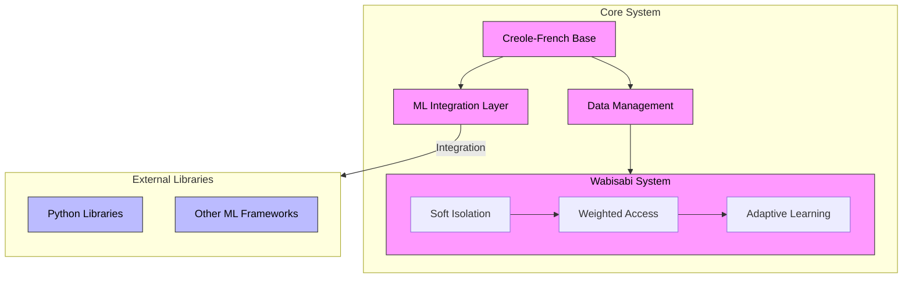

I notice this appears to be describing a hypothetical programming language concept. Let me help break down what we're looking at and explore how such a system might work.

###  Language Concept Analysis

This proposed language combines several interesting elements:

- A Creole-based structure drawing from French
- Japanese linguistic influences
- Specialization in machine learning integration
- Unique approach to data handling ("wabisabi")

###  Technical Architecture

Let's visualize how this system might be structured:



The diagram above illustrates several key concepts:

- The pink sections represent the core system components
- Blue sections show external library integrations
- Arrows indicate data and control flow between components

The Wabisabi system acts as a middleware layer between the core data management and ML operations, implementing soft isolation through weighted access controls rather than traditional hard boundaries.

###  Technical Implementation

Here's how the wabisabi concept might be implemented in practice:

```python
class WabisabiIsolator:
    def __init__(self):
        self.isolation_weights = {}
        self.access_patterns = {}
    
    def soft_isolate(self, data_id, weight=0.8):
        """Implement partial isolation with configurable weights"""
        self.isolation_weights[data_id] = weight
        
    def get_data_access(self, data_id):
        """Controlled access based on isolation weights"""
        weight = self.isolation_weights.get(data_id, 1.0)
        return {
            'data': self.data_store[data_id],
            'access_weight': weight,
            'metadata': self.access_patterns[data_id]
        }
```

###  Linguistic Integration

The Creole-French base with Japanese influences suggests interesting possibilities:

```text
# Example syntax combining French and Japanese concepts
wabisabi isoler données sensibles avec poids 0.7
apprentissage doux démarrer avec modèle base
kairos ajuster hyperparamètres automatiquement
```

###  Practical Applications

This specialized ML framework could offer unique advantages:

1. **Soft Isolation Benefits**  - Gradual data separation rather than binary inclusion/exclusion
  - Weighted learning from partially isolated datasets
  - Adaptive model training based on data confidence levels


2. **Integration Capabilities**  - Seamless interaction with existing ML ecosystems
  - Unified interface for diverse ML frameworks
  - Specialized Creole-based syntax for ML operations


###  Future Development Considerations

To bring this concept to reality, key areas would need development:

1. **Language Foundation**  - Formal grammar specification
  - Runtime environment design
  - Package management system


2. **ML Integration Layer**  - Python interoperability
  - Native ML primitive implementation
  - Performance optimization


3. **Wabisabi System**  - Weight calculation algorithms
  - Access pattern learning
  - Adaptive isolation strategies


Would you like to explore any particular aspect of this concept in more detail? We could dive deeper into the linguistic structure, technical architecture, or specific implementation challenges.
